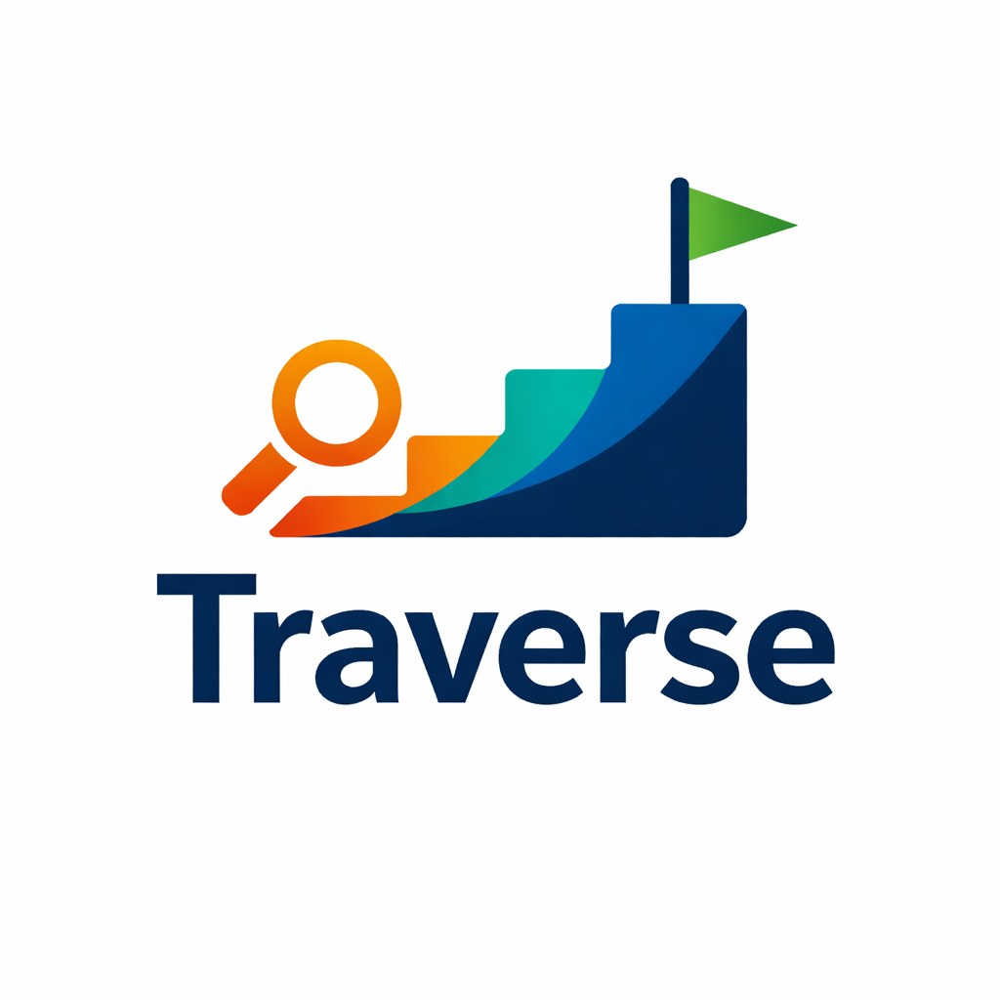

# Traverse

Traverse is an AI agent system that reverse-engineers expertise into personalized learning DAGs. It researches real-world signals, builds a dependency graph, and generates realistic challenges that adapt as you learn.



## Features
- Research agent that extracts competencies from real-world sources
- DAG builder that sequences skills with prerequisites
- Challenge generator with realistic, scenario-based tasks
- Adaptive remediation that inserts prerequisite nodes when you struggle
- Progress tracking with blocked/in-progress/completed states
- OPIK tracing + LLM-as-judge evaluation hooks
- Interactive DAG visualization in the frontend

## Deployment
App is online at [text](https://traverse-six.vercel.app/)
Pitch Deck at [text](https://docs.google.com/presentation/d/1iyD63tCriSZ0QJKpnlbeG6vs3qKoVwOuAAEfo1NQOF8/edit?usp=sharing)
Video demo : [text](https://youtu.be/ajCN6gpiwUQ)
One Liner : Traverse is an AI agent system that reverse-engineers expertise to build personalized learning paths.

## AI Agent System
Traverse is built as a set of focused agents with clear inputs/outputs. Together they form a feedback loop that adapts the learning path based on real performance.

```
Research Agent -> DAG Builder -> Challenge Agent -> Tutor Agent
                                      ^               |
                                      |               v
                                Remedial Node <---- Struggle Detection
```

### Agents and Responsibilities
- Research Agent: extracts competencies from real-world sources (jobs, blogs, repos).
- DAG Builder: converts competencies into a prerequisite graph (acyclic DAG).
- Challenge Agent: generates proof-of-competency challenges grounded in research.
- Tutor Agent: evaluates answers with a rubric and decides pass/retry + remediation.
- Remedial Node Agent: inserts a new prerequisite node when a learner is blocked.

### Adaptive Feedback Loop
When a learner fails a node multiple times, the tutor agent proposes a remedial topic.
The system inserts a new prerequisite node and rewires the DAG so the learner can
close the gap before retrying the original node.

### Agent Guardrails
- JSON schema enforcement with retry on malformed model output
- DAG validation to guarantee acyclicity and valid edges
- LLM-as-judge evaluation hooks (OPIK) for research, DAG, challenge, and tutor quality

### Where to Look in Code
- Agents: `backend/agents/`
- Agent orchestration: `backend/routes/paths.py`, `backend/routes/challenges.py`
- Evaluations/observability: `backend/services/opik_client.py`

## Architecture
- Backend: FastAPI API + multi-agent pipeline + SQLAlchemy models
- Frontend: Next.js app with ReactFlow graph rendering
- External services: Gemini, SerpAPI, Supabase auth, OPIK tracing

## Tech Stack
FastAPI, SQLAlchemy, PostgreSQL/Supabase, Next.js, React, ReactFlow, Gemini, SerpAPI, OPIK

## Getting Started (Local)

### Supabase
1. Create a Supabase project and copy the Project URL + anon key.
2. Configure frontend env vars: `NEXT_PUBLIC_SUPABASE_URL`, `NEXT_PUBLIC_SUPABASE_ANON_KEY`.
3. Configure backend env vars: `SUPABASE_URL`, `SUPABASE_ANON_KEY`.
4. Enable your preferred auth providers (GitHub/Google) in Supabase if you plan to sign in.
5. If you use a custom JWT audience, set `SUPABASE_JWT_AUDIENCE` in backend `.env`.

### Backend
```
cd backend
python -m venv .venv
source .venv/bin/activate
pip install -r requirements.txt
alembic upgrade head
uvicorn main:app --reload --port 8000
```

### Frontend
```
cd frontend
npm install
npm run dev
```

## Configuration

### Backend `.env`
Required:
- `DATABASE_URL`
- `GOOGLE_API_KEY`
- `GEMINI_MODEL`
- `SERPAPI_API_KEY`
- `SUPABASE_URL`
- `SUPABASE_ANON_KEY`

Optional:
- `OPIK_TRACK_DISABLE` (set to `true` to disable tracing)

### Frontend `.env.local`
Required:
- `NEXT_PUBLIC_SUPABASE_URL`
- `NEXT_PUBLIC_SUPABASE_ANON_KEY`
- `NEXT_PUBLIC_API_URL`

## Running Tests
```
cd backend
pytest
```

E2E tests are skipped unless `RUN_E2E_TESTS=true` is set.

## API Reference (Minimal)
- `POST /api/paths`
- `GET /api/paths`
- `GET /api/paths/{id}`
- `POST /api/paths/{id}/nodes/{node_id}/challenges`
- `POST /api/challenges/{id}/submit`
- `POST /api/challenges/{id}/hint`
- `GET /api/paths/{id}/progress`

## Deployment
- Frontend: deploy to Vercel with frontend env vars
- Backend: deploy to Cloud Run with backend env vars
- Ensure the backend URL is configured in `NEXT_PUBLIC_API_URL`

## Observability (OPIK)
OPIK traces are emitted from all agents with prompt versions and key metadata (user/path/node context, counts, and parse errors). Each stage is evaluated with LLM-as-judge scores so quality can be tracked over time.

### What Gets Traced
- Research, DAG, challenge, and tutor agent runs
- Prompt version + experiment variant
- Input/output summaries (token-safe previews)
- Parsing failures and fallback usage

### Evaluation Strategy
- LLM-as-judge scoring for research quality, DAG structure, challenge realism, and tutor feedback
- Scores logged per run to support regression tracking and prompt iteration

### A/B Testing
- Deterministic variant assignment per user
- Prompt variants tracked in Opik for comparison
- Supports continuous prompt optimization

Disable locally by setting `OPIK_TRACK_DISABLE=true`.

## Roadmap
- Improve interview flow with dynamic follow-ups
- Add richer research grounding and source filtering
- Expand analytics and A/B experimentation


## License
MIT
